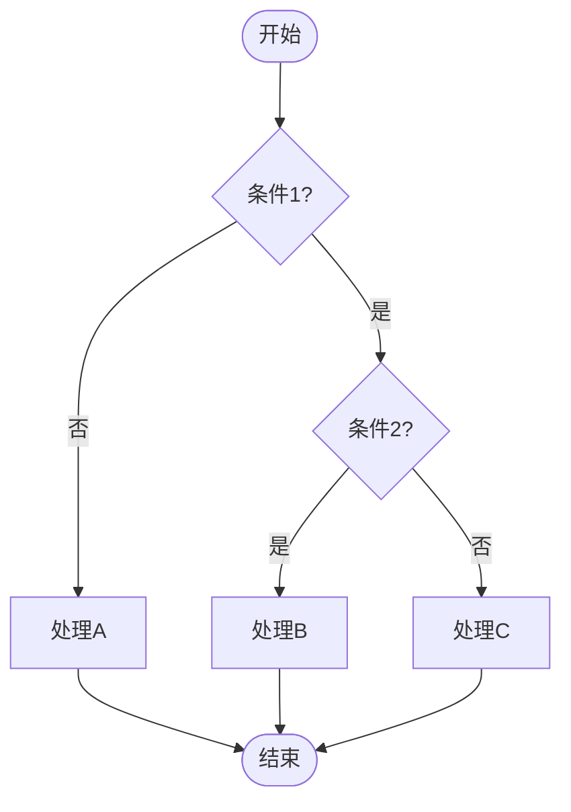
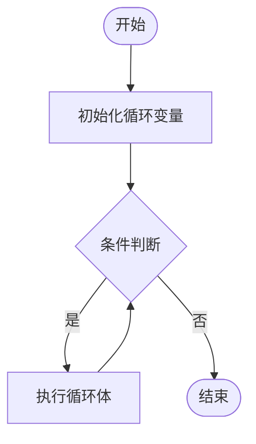
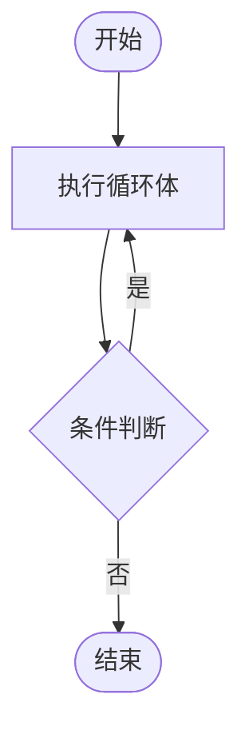
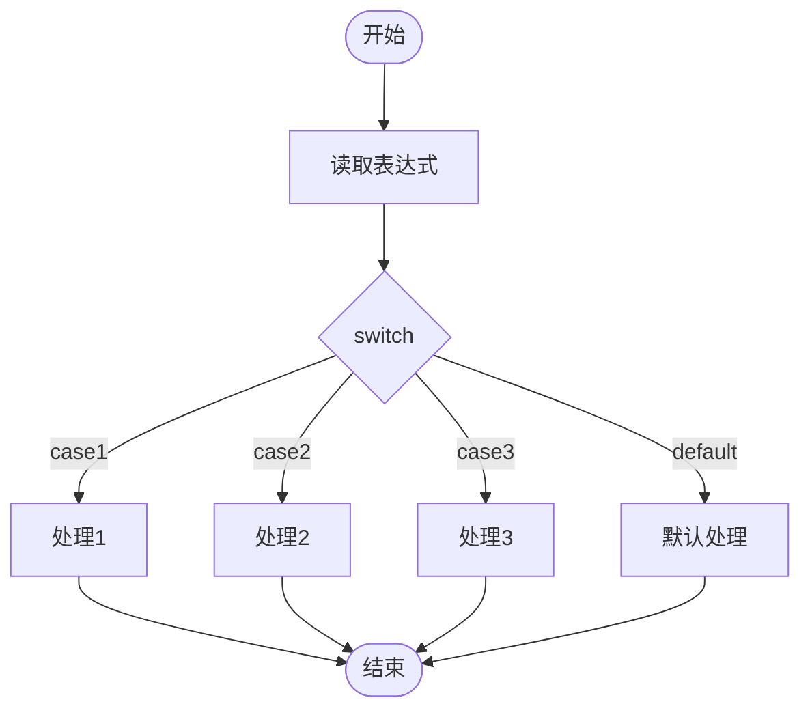
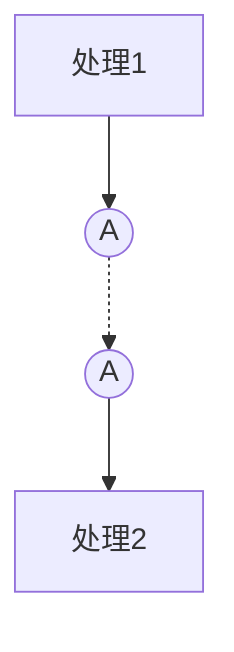
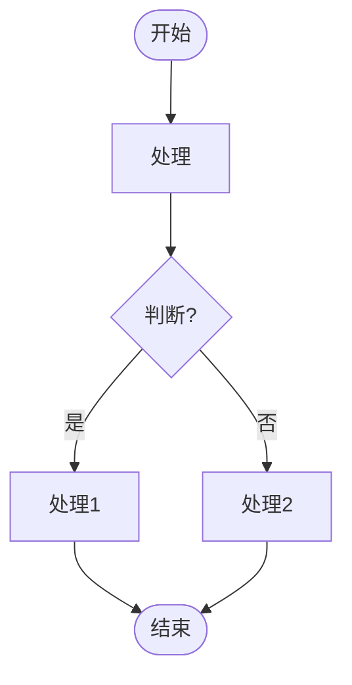
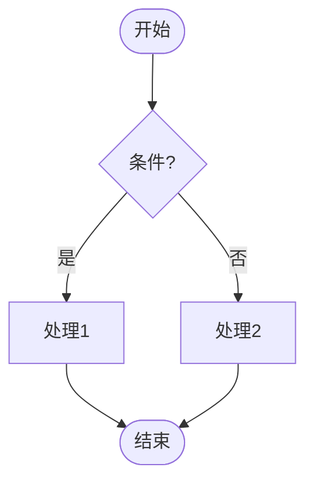

# 流程图编制规范（G-C110）

## 1. 概述

本文档基于公司规范 G-C110 流程图编制规范_A0，定义流程图的符号、样式和绘制要求。

## 2. 符号定义

### 2.1 基本符号

| 符号 | 形状 | 用途 | Mermaid语法 |
|------|------|------|-------------|
| 端点符 | 圆角矩形 | 开始/结束 | `([开始])` |
| 处理符 | 矩形 | 执行操作 | `[处理]` |
| 判断符 | 菱形 | 条件判断 | `{条件?}` |
| 数据符 | 平行四边形 | 数据输入/输出 | `[/数据/]` |
| 既定处理 | 双竖线矩形 | 子程序/模块 | `[[子程序]]` |
| 连接符 | 圆形 | 流程转向 | `((A))` |
| 注解符 | 虚线框 | 注释说明 | 无标准语法 |

### 2.2 流线符号

| 符号 | 用途 | Mermaid语法 |
|------|------|-------------|
| 实线箭头 | 控制流/数据流 | `-->` |
| 虚线 | 注解连接 | `-.->` |

## 3. 判断框出线规范（重要）

### 3.1 判断框入口

```
        ↑ 入口（上方顶点）
        |
    +---v---+
    |       |
    | 条件? |
    |       |
    +---+---+
        |
        v
```

**入口位置**：判断框的**上方顶点**

### 3.2 判断框出口

```
        ↑ 入口
        |
    +---v---+
    |       |
    | 条件? |
    |       |
    +---+---+
        |           |
        v           |
      [是]          +---> [否]
    (下方顶点)        (右中方顶点)
```

**出口规则**：
- **判断成立（是）**：从判断框的**正下方顶点**出线
- **判断不成立（否）**：从判断框的**右中方顶点**出线

### 3.3 走线规范（重要）

**基本原则**：
- **不允许斜线**：所有走线必须是水平线或垂直线
- **折线连接**：需要改变方向时，使用横竖折线
- **对齐要求**：相关节点应在同一水平线或垂直线上

**标准走线方式**：

```
        [开始]
           |
           v
       {条件?}
        /     \
       |       |
       v       v
     [是]    [否]
       |       |
       v       v
     [处理]    |
       |       |
       v       |
     [结束] <--+
```

**走线说明**：
1. 条件成立：垂直向下出线
2. 条件不成立：水平向右出线，然后垂直向下
3. 两条路径最终汇合到同一节点

### 3.4 判断汇合走线规范

当"否"分支需要连接到"是"分支下游的节点时，采用以下方式：

**方式一：直接汇合到结束节点（推荐）**
```
        [开始]
           |
           v
       {条件?}
        /     \
       |       |
       v       v
    [操作A]  [操作B]
       |
       v
    [结束] <-----+
                  |
           [操作B]的出线：
           1. 竖线向下一半
           2. 左折到结束框上方线上
```

**走线规则**：
- 操作B的出线：竖线向下一半距离，然后左折到结束框的垂直线上
- 箭头指示在水平线上
- 不需要继续向下连接到结束框

### 3.6 标准判断流程


**节点布局要求**：
- 处理1和处理2应在同一水平线上
- 结束节点应在处理1的正下方

### 3.7 复杂判断流程



## 4. 循环结构规范

### 4.1 For循环

```mermaid
graph TD
    A([开始]) --> B[i = 0]
    B --> C{i < 10?}
    C -->|是| D[处理数据[i]]
    D --> E[i = i + 1]
    E --> C
    C -->|否| F([结束])
```

**结构说明**：
1. 初始化循环变量
2. 条件判断（菱形）
3. 判断成立 → 执行循环体
4. 操作循环变量
5. 返回条件判断
6. 判断不成立 → 退出循环

**For循环节点组成**：

| 节点 | 类型 | 说明 |
|------|------|------|
| 开始 | 椭圆形 | 流程起点 |
| 初始化 | 矩形 | 初始化循环变量（如 i = 0） |
| 判断 | 菱形 | 循环条件判断（如 i < 10?） |
| 循环体 | 矩形 | 循环执行的操作 |
| 增量 | 矩形 | 更新循环变量（如 i = i + 1） |
| 结束 | 椭圆形 | 流程终点 |

**For循环节点布局要求**：

```
        [开始]              ← 顶部居中
           |
        [初始化]           ← 开始节点正下方
           |
        {判断?}            ← 初始化节点正下方
        /     \
       |       |
    [循环体]  [增量]       ← 循环体在判断正下方，增量在判断右侧
       |
    [结束]                 ← 循环体正下方
```

**布局坐标计算**：
- **开始节点**：x = left_margin, y = 0
- **初始化节点**：x = left_margin, y = 开始节点y + 开始节点高度 + 间距
- **判断节点**：x = left_margin, y = 初始化节点y + 初始化节点高度 + 间距
- **循环体节点**：x = left_margin, y = 判断节点y + 判断节点高度 + 间距
- **增量节点**：x = left_margin + 判断节点宽度/2 + 增量节点宽度/2 + 间距, y = 判断节点y
- **结束节点**：x = left_margin, y = 循环体节点y + 循环体节点高度 + 间距

**left_margin** = 判断节点宽度（为左侧出线留出空间）

**For循环走线规范**：

1. **开始 → 初始化**：
   - 类型：垂直线
   - 起点：开始节点下方边框中点
   - 终点：初始化节点上方边框中点

2. **初始化 → 判断**：
   - 类型：垂直线
   - 起点：初始化节点下方边框中点
   - 终点：判断节点上方顶点

3. **判断 → 循环体（是分支）**：
   - 类型：垂直线
   - 起点：判断节点下方顶点
   - 终点：循环体节点上方边框中点
   - 标签："是"

4. **循环体 → 增量**：
   - 类型：折线（右横 + 上竖）
   - 走线：
     1. 从循环体节点右侧边框中点出横线
     2. 向右横到增量节点x坐标
     3. 向上竖到增量节点下方边框中点
   - 箭头：指向增量节点下方边框中点

5. **增量 → 判断**：
   - 类型：折线（上竖 + 左横）
   - 走线：
     1. 从增量节点上方边框中点出线
     2. 向上竖到判断节点上方一定距离
     3. 向左横到初始化节点到判断节点的垂直线上
   - 箭头：指向左边（指向垂直线）

6. **判断 → 结束（否分支）**：
   - 类型：折线（左横 + 下竖 + 右横 + 下竖）
   - 走线：
     1. 从判断节点左顶点出线
     2. 向左横半个判断框长度
     3. 向下竖到结束框和循环体框的中点
     4. 向右横到结束节点正上方
     5. 向下连接到结束节点上方边框中点
   - 箭头：指向结束节点上方边框中点
   - 标签："否"

**For循环布局示例**：
```
         [开始]
            |
            v
       [i = 0]
            |
            v
    [i < 10?] ----------> [i = i + 1]
       |                     |
       否                    |
       |                     |
       v                     v
    [处理数据] <-----------+
       |
       v
     [结束]
```

### 4.2 While循环



**结构说明**：
1. 初始化循环变量
2. 条件判断（菱形）
3. 判断成立 → 执行循环体
4. 返回条件判断
5. 判断不成立 → 退出循环

### 4.3 Do-While循环



**结构说明**：
1. 执行循环体
2. 条件判断（菱形）
3. 判断成立 → 返回执行循环体
4. 判断不成立 → 退出循环

### 4.4 Switch Case结构



**结构说明**：
1. 开始
2. 读取表达式
3. Switch判断（菱形）
4. 多个分支执行（case1、case2、...、default）
5. 结束

**Switch Case节点组成**：

| 节点 | 类型 | 说明 |
|------|------|------|
| 开始 | 椭圆形 | 流程起点（竖向） |
| 初始化 | 矩形 | 读取表达式 |
| 判断 | 菱形 | Switch判断框 |
| 分支执行 | 矩形 | 各case对应的处理 |
| 结束 | 椭圆形 | 流程终点（竖向） |

**Switch Case布局要求**：

```
        [开始]                ← 顶部居中
           |
        [初始化]             ← 开始节点正下方
           |
        {switch}             ← 初始化节点正下方
       /   |   \   \
      /    |    \   \
  [case1] [case2] [case3] [default]  ← 并行排布，同一水平线
      \    |    /   /
       \   |   /   /
        [结束]               ← 与开始框竖向对齐
```

**布局坐标计算**：
- **开始节点**：x = 0, y = 0（居中）
- **初始化节点**：x = 0, y = 开始节点y + 开始节点高度 + 间距
- **判断节点**：x = 0, y = 初始化节点y + 初始化节点高度 + 间距
- **分支执行节点**：并行排布，同一水平线
  - y = 判断节点y + 判断节点高度 + 间距 * 2
  - x = 从左到右均匀分布
- **结束节点**：x = 0（与开始框竖向对齐）, y = 分支执行节点y + 节点高度 + 间距 * 2

**Switch Case走线规范**：

1. **开始 → 初始化**：
   - 类型：垂直线
   - 起点：开始节点下方边框中点
   - 终点：初始化节点上方边框中点

2. **初始化 → 判断**：
   - 类型：垂直线
   - 起点：初始化节点下方边框中点
   - 终点：判断节点上方顶点

3. **判断 → 各分支执行框**：
   - 有3种连线方式：
     - **正下方**：直接往下（垂直线）
     - **左侧**：先向下竖（判断框和执行框的中点距离），然后向左到执行框中点上方，最后向下
     - **右侧**：先向下竖（判断框和执行框的中点距离），然后向右到执行框中点上方，最后向下
   - 箭头：指向执行框上方边框中点
   - 标签：写在横线上方（case1、case2、case3、default）

4. **各分支执行框 → 结束框**：
   - 有3种连线方式：
     - **正下方**：直接往下（垂直线）
     - **左侧**：先向下竖（执行框和结束框的中点距离），然后向左到结束框中点上方，最后向下
     - **右侧**：先向下竖（执行框和结束框的中点距离），然后向右到结束框中点上方，最后向下
   - 箭头：指向结束框上方边框中点

**Switch Case走线原则**：
1. 不允许斜线：所有走线必须是水平线或垂直线
2. 线应有重叠部分：相邻分支的走线在竖向部分有重叠
3. 箭头指向：所有箭头指向目标节点的边框中点
4. 标签位置：写在横线上方，确保字整体在横线的上方

**Switch Case布局示例**：
```
         [开始]
            |
            v
       [读取表达式]
            |
            v
         {switch}
        /   |   \   \
       /    |    \   \
   case1  case2  case3  default
       |    |    |    |
    [处理1][处理2][处理3][默认处理]
       |    |    |    |
       \    |    /   /
        \   |   /   /
         [结束]
```

## 5. 样式规范

### 5.1 字体要求

- **字体**：楷体（如不可用，使用黑体或宋体）
- **字号**：10号
- **书写方向**：从左到右，从上到下

### 5.2 流向要求

- **标准流向**：从左到右，从上到下
- **流线箭头**：必须有箭头指示流向
- **流线交叉**：尽量避免，交叉无逻辑关系
- **流线汇集**：多根流线可汇集成一根
- **走线方式**：只能使用水平线和垂直线，不允许斜线

### 5.3 符号要求

- **符号方向**：保持水平，不能镜像
- **符号大小**：尽可能统一
- **符号布局**：均匀分配空间，连线保持合理长度
- **符号形状**：
  - 端点符（开始/结束）：圆角矩形
  - 处理符：矩形
  - 判断符：菱形
  - 数据符：平行四边形

### 5.4 连接要求

- **入口位置**：符号的左边或顶端
- **出口位置**：符号的右边或底端
- **对齐方式**：对准符号的中心
- **相关节点**：应在同一水平线或垂直线上

## 6. 特殊情况处理

### 6.1 多个出口

**方式一**：直接引出多条流线
```
    +-------+
    |       |
    | 处理  |----> [A]
    |       |----> [B]
    +-------+----> [C]
```

**方式二**：引出一条流线后分支
```
    +-------+
    |       |
    | 处理  |---->----+----> [A]
    |       |        |
    +-------+        +----> [B]
                     |
                     +----> [C]
```

### 6.2 连接符使用

当流程图过大或需要跨页时，使用连接符：



**连接符规则**：
- 对应的连接符使用相同标记
- 使用大写英文字母作为标记
- 虚线连接对应的连接符

### 6.3 注解符使用

```
    +-------+
    |       |
    | 处理  |--- - - ---+ 注解内容
    |       |          |
    +-------+----------+
```

**注解符规则**：
- 虚线连接到相关符号
- 注解正文靠近边线
- 说明文字过多时使用注解符

## 7. 页面控制

### 7.1 流程图大小控制

**原则**：流程图不能垮页

**控制方法**：
1. **拆分流程图**
   - 使用连接符将大流程图拆分为多个小图
   - 每个小图控制在一页内

2. **调整布局**
   - 合理安排符号位置
   - 避免过长的流线
   - 使用紧凑布局

3. **分层表示**
   - 主流程图展示整体流程
   - 子流程图展示详细步骤

### 7.2 图片大小控制

**原则**：插入文档的流程图应控制大小，便于阅读

**控制标准**：
- **高度限制**：约8cm（300像素）
- **宽度限制**：根据内容自适应，但不超过页面宽度
- **缩放方式**：等比例缩放，保持清晰度

**实现方式**：
1. 生成流程图时限制最大高度
2. 插入文档时设置合适的图片尺寸
3. 保持图片清晰度，避免模糊

### 7.3 页面布局建议

```
┌─────────────────────────────────┐
│  流程图标题                       │
├─────────────────────────────────┤
│                                 │
│  [开始] --> [处理1] --> [处理2]   │
│     |                      |    │
│     v                      v    │
│  [处理3] --> [结束]              │
│                                 │
├─────────────────────────────────┤
│  页码：1/1                       │
└─────────────────────────────────┘
```

## 8. Mermaid语法速查

### 8.1 基本语法



### 8.2 符号表示

| 符号类型 | Mermaid语法 | 示例 |
|----------|-------------|------|
| 圆角矩形 | `([文本])` | `([开始])` |
| 矩形 | `[文本]` | `[处理]` |
| 菱形 | `{文本}` | `{条件?}` |
| 平行四边形 | `[/文本/]` | `[/数据/]` |
| 双竖线矩形 | `[[文本]]` | `[[子程序]]` |
| 圆形 | `((文本))` | `((A))` |

### 8.3 连接线表示

| 连接类型 | Mermaid语法 | 示例 |
|----------|-------------|------|
| 实线箭头 | `-->` | `A --> B` |
| 虚线箭头 | `-.->` | `A -.-> B` |
| 带标签 | `-->|标签|` | `A -->|是| B` |
| 无箭头 | `---` | `A --- B` |

### 8.4 走线规范说明

**重要**：Mermaid默认可能生成斜线，需要通过布局控制实现横竖走线

**实现方式**：
1. 使用Python绘图渲染器（推荐）
2. 调整节点位置，确保相关节点在同一水平线或垂直线上
3. 使用折线连接，避免斜线

**示例**：


**节点布局**：
- 处理1和处理2在同一水平线上
- 结束节点在处理1的正下方
- 处理2通过折线连接到结束节点

## 9. 检查清单

### 9.1 符号检查

- [ ] 使用正确的符号形状
- [ ] 符号保持水平方向
- [ ] 符号大小统一
- [ ] 符号内文字简洁
- [ ] 端点符使用圆角矩形

### 9.2 流线检查

- [ ] 流线有箭头指示
- [ ] 标准流向从左到右、从上到下
- [ ] 避免流线交叉
- [ ] 流线对准符号中心
- [ ] **不允许斜线**：只使用水平线和垂直线
- [ ] **折线连接**：需要改变方向时使用横竖折线

### 9.3 判断框检查

- [ ] 入口在上方顶点
- [ ] 成立出口在下方顶点
- [ ] 不成立出口在右中方顶点
- [ ] 出口标注条件值
- [ ] **相关节点对齐**：条件成立和条件不成立的处理节点应在同一水平线上

### 9.4 循环检查

- [ ] For循环：初始化→判断→循环体→增量→判断
- [ ] While循环：初始化→判断→循环体→判断
- [ ] Do-While循环：循环体→判断→循环体

### 9.5 页面检查

- [ ] 流程图不垮页
- [ ] 符号均匀分布
- [ ] 连线长度合理
- [ ] 使用连接符拆分大图
- [ ] **图片大小**：高度限制在8cm左右

### 9.6 走线规范检查

- [ ] 所有走线都是水平线或垂直线
- [ ] 没有斜线
- [ ] 需要改变方向时使用折线
- [ ] 相关节点在同一水平线或垂直线上

## 10. 参考文件

- G-C110 流程图编制规范_A0.docx
- GB/T 1526-1989 信息处理 数据流程图、程序流程图、系统流程图、程序网络图和系统资源图的文件编制符号及约定
