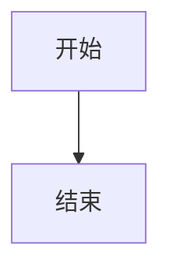

# No Silent Content Loss

## Mixed text and image paragraph

请参考下图  完成接口连接。

## Raw HTML block

<div class="warning">禁止带电插拔。</div>

## Single image paragraph keeps legacy figure behavior


## Table identity

| 名称 | 说明 |
| ---- | ---- |
| ENABLE | 使能控制 |

## Code block identity

```c
uint8_t value = read_reg(0x00);
```

## Diagram identity



## Wide register table for layout planning

<!-- table: register -->
| Address | Register | Bits | Access | Reset | Clock | Domain | Description |
| ------- | -------- | ---- | ------ | ----- | ----- | ------ | ----------- |
| 0x00 | CTRL | [3:0] | RW | 0x0 | APB | SYS | Very long control register description for overflow risk planning. |
