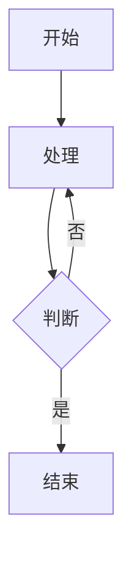

# 验证测试文档

## 一级标题

### 二级标题

#### 三级标题

这是一个普通段落，包含**粗体**和*斜体*文本。

## 列表测试

### 无序列表
- 项目1
- 项目2
  - 嵌套项目2.1
  - 嵌套项目2.2
- 项目3

### 有序列表
1. 第一项
2. 第二项
   1. 嵌套2.1
   2. 嵌套2.2
3. 第三项

## 表格测试

| 序号 | 名称 | 描述 |
|------|------|------|
| 1 | 功能A | 测试功能A |
| 2 | 功能B | 测试功能B |

## 代码块测试

```python
def hello():
    print("Hello World")
```

## 引用测试

> 这是一个引用块
> 第二行引用

## 链接测试

[示例链接](https://example.com)

## 分割线测试

---

## 流程图测试


