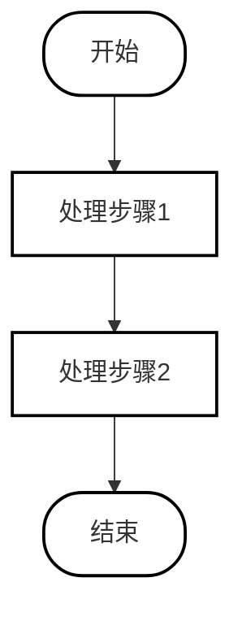
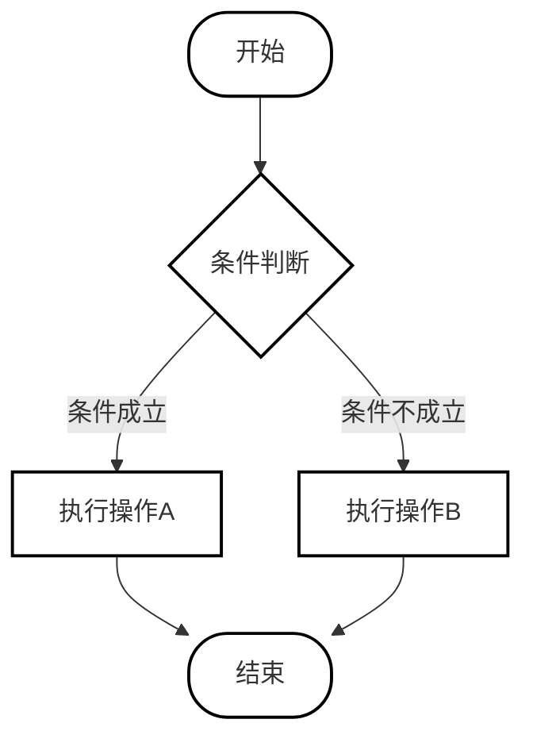
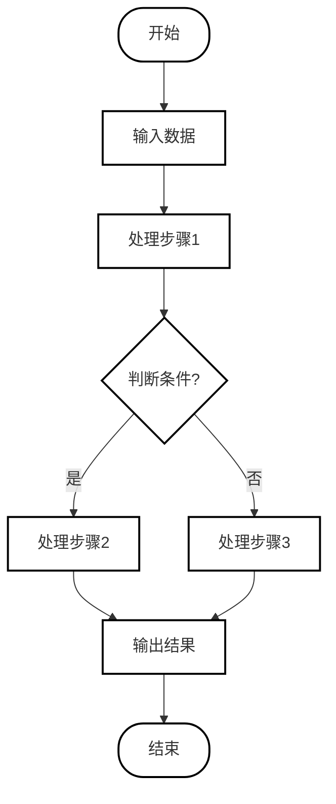
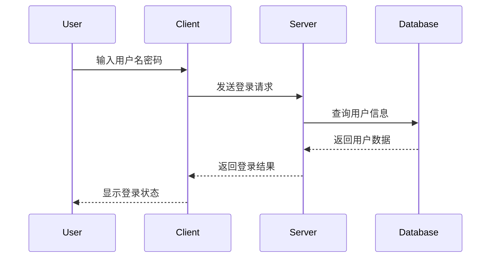
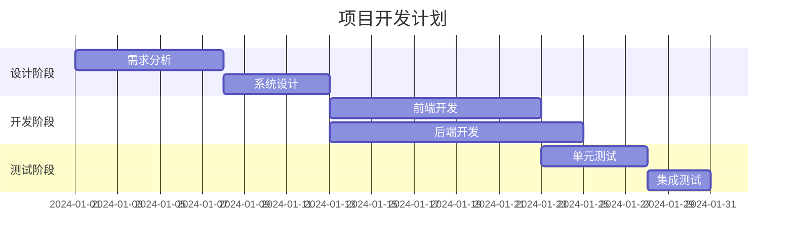

# 完整验证测试文档

## 1. 基础文本格式

### 1.1 标题层级

# 一级标题 H1
## 二级标题 H2
### 三级标题 H3
#### 四级标题 H4
##### 五级标题 H5
###### 六级标题 H6

### 1.2 段落格式

这是第一个段落，测试段落间距和换行。

这是第二个段落，中间有空行分隔。

这是第三段，包含**粗体文本**和*斜体文本*以及***粗斜体***。

### 1.3 强调格式

- **粗体**：使用双星号
- *斜体*：使用单星号
- ***粗斜体***：使用三星号
- ~~删除线~~：使用双波浪号

## 2. 列表格式

### 2.1 无序列表

- 一级项目1
- 一级项目2
  - 二级项目2.1
  - 二级项目2.2
    - 三级项目2.2.1
    - 三级项目2.2.2
- 一级项目3

### 2.2 有序列表

1. 第一项
2. 第二项
   1. 子项2.1
   2. 子项2.2
      1. 子子项2.2.1
      2. 子子项2.2.2
3. 第三项

### 2.3 混合列表

1. 有序项目1
   - 无序子项1.1
   - 无序子项1.2
2. 有序项目2
   - 无序子项2.1

## 3. 表格格式

### 3.1 简单表格

| 姓名 | 年龄 | 职位 |
|------|------|------|
| 张三 | 25 | 工程师 |
| 李四 | 30 | 设计师 |
| 王五 | 28 | 产品经理 |

### 3.2 复杂表格

| 功能模块 | 状态 | 负责人 | 备注 |
|----------|------|--------|------|
| 用户登录 | ✅完成 | 张三 | 已上线 |
| 数据导出 | 🔄进行中 | 李四 | 预计周五完成 |
| 权限管理 | ❌未开始 | 王五 | 待排期 |

### 3.3 对齐表格

| 左对齐 | 居中 | 右对齐 |
|:-------|:----:|-------:|
| 文本1 | 文本2 | 文本3 |
| 较长的文本 | 中等 | 短 |

## 4. 代码格式

### 4.1 内联代码

使用 `print()` 函数输出，变量名为 `my_variable`。

### 4.2 代码块

```python
def fibonacci(n):
    """计算斐波那契数列"""
    if n <= 1:
        return n
    return fibonacci(n-1) + fibonacci(n-2)

# 测试
for i in range(10):
    print(fibonacci(i))
```

```javascript
// JavaScript代码示例
function greet(name) {
    return `Hello, ${name}!`;
}

console.log(greet('World'));
```

```sql
-- SQL查询示例
SELECT u.name, u.email, o.total
FROM users u
JOIN orders o ON u.id = o.user_id
WHERE o.created_at > '2024-01-01'
ORDER BY o.total DESC;
```

## 5. 引用格式

### 5.1 单层引用

> 这是一个引用块。
> 可以包含多行文本。
> 用于引用他人的话或文档。

### 5.2 嵌套引用

> 第一层引用
>
> > 第二层引用
> >
> > > 第三层引用

### 5.3 引用中包含其他格式

> **重要提示**：这段引用包含*强调文本*和`代码`。
>
> 还可以包含列表：
> - 项目1
> - 项目2

## 6. 链接格式

### 6.1 普通链接

[GitHub](https://github.com)

[Python官网](https://python.org)

### 6.2 带标题的链接

[GitHub](https://github.com "访问GitHub")

## 7. 图片格式

### 7.1 本地图片


### 7.2 远程图片


## 8. 分割线

---

***

___

## 9. 特殊格式

### 9.1 脚注

这是一个带有脚注的文本[^1]。

[^1]: 这是脚注内容。

### 9.2 任务列表

- [x] 已完成任务1
- [x] 已完成任务2
- [ ] 未完成任务3
- [ ] 未完成任务4

### 9.3 定义列表

术语1
: 定义1的第一行
: 定义1的第二行

术语2
: 定义2

## 10. 流程图测试

### 10.1 简单流程图



### 10.2 带判断的流程图



### 10.3 复杂流程图



### 10.4 时序图



### 10.5 甘特图



## 11. 数学公式

### 11.1 内联公式

勾股定理：$a^2 + b^2 = c^2$

二次公式：$x = \frac{-b \pm \sqrt{b^2-4ac}}{2a}$

### 11.2 块级公式

$$
\sum_{i=1}^{n} i = \frac{n(n+1)}{2}
$$

$$
\int_{0}^{\infty} e^{-x^2} dx = \frac{\sqrt{\pi}}{2}
$$

## 12. HTML元素

### 12.1 键盘按键

按下 <kbd>Ctrl</kbd> + <kbd>C</kbd> 复制

### 12.2 高亮文本

这是 ==高亮文本== 示例

## 13. 复杂嵌套

### 13.1 列表中嵌套其他格式

1. **重要功能**
   - 包含`代码`的列表项
   - 包含[链接](https://example.com)的列表项
   - 包含的列表项

2. *强调功能*
   > 列表中的引用
   >
   > 包含多行

3. 表格示例

   | 列1 | 列2 |
   |-----|-----|
   | A   | B   |

### 13.2 引用中嵌套其他格式

> ## 引用中的标题
>
> 引用中的**粗体**和*斜体*
>
> ```python
> # 引用中的代码块
> print("Hello")
> ```
>
> | 引用中的表格 |
> |--------------|
> | 数据         |

---

**文档结束**

以上包含所有需要验证的Markdown格式元素，请逐一检查转换效果。
